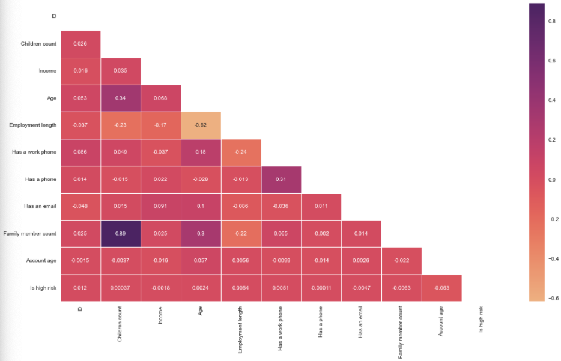

## Key findings: People with the highest income, and who have at least one partner, are more likely to be approved for a credit card.

## Table of Contents

  - [Business problem](#business-problem)
  - [Data source](#data-source)
  - [Methods](#methods)
  - [Tech Stack](#tech-stack)
  - [Quick glance at the results](#quick-glance-at-the-results)
  - [Lessons learned and recommendation](#lessons-learned-and-recommendation)
  - [Limitation and what can be improved](#limitation-and-what-can-be-improved)

## Business problem

This app predicts if an applicant will be approved for a credit card or not. Each time there is a hard enquiry your credit score is affected negatively. This app predict the probability of being approved without affecting your credit score. This app can be used by applicant who wants to find out if they will be approved for a credit card without affecting their credit score.
## Data source

- [Kaggle credit card approval prediction](https://www.kaggle.com/rikdifos/credit-card-approval-prediction)

## Methods

- Exploratory data analysis
- Bivariate analysis
- Multivariate correlation
  
## Tech Stack

- Python (refer to requirement.txt for the packages used in this project)
- Streamlit (interface for the model)

## Quick glance at the results

Correlation between the features.

Confusion matrix of gradient boosting classifier.

ROC curve of gradient boosting classifier.

Top 3 models (with default parameters)

| Model     	                | Recall score 	|
|-------------------	        |------------------	|
| Support vector machine     	| 88% 	            |
| Gradient boosting    	        | 90% 	            |
| Adaboost               	    | 79% 	            |

- **The final model used for this project: Gradient boosting**
- **Metrics used: Recall**
  Since the objective of this problem is to minimize the risk of a credit default

 **Lessons learned and recommendation**

- Based on this project's analysis, income, family member headcount, and employment length are the three most predictive features in determining whether an applicant will be approved for a credit card. Other features like age and working employment status are also helpful. The least useful features are the type of dwelling and car ownership.
- The recommendation would be to focus more on the most predictive features when looking at the applicant profile and pay less attention to the least predictive features.

## Limitation and what can be improved

- Combine this model with with a regression model to predict how much of a credit limit an applicant will be approved for.
- Hyperparameter tuning with grid search or random search.
- Better interpretation of the chi-square test
- Retrain the model without the least predictive features
